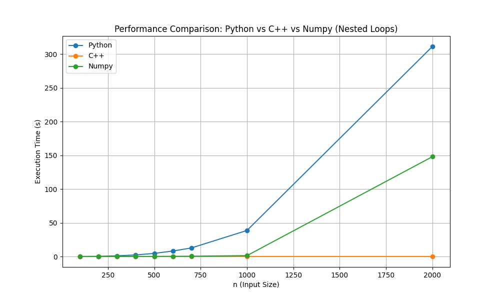
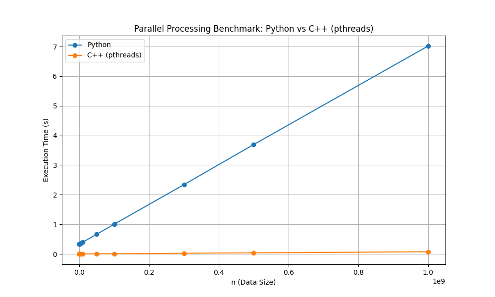

### Python vs C++(pybind11) benchmark

This repository contains three different benchmarking scenarios comparing Python and C++ implementations for various tasks. The C++ code is executed from Python using **pybind11**, which allows us to seamlessly integrate C++ performance with Python code.

The benchmarks include the following:

1. **List Benchmark**: This benchmark compares the performance of summing large lists in Python and C++.
2. **Nested Loops Benchmark**: This compares the performance of three nested loops in Python, C++, and NumPy.
3. **Parallel Benchmark**: This benchmark focuses on comparing parallelized tasks in Python and C++.

Each of the benchmarks includes Python, C++ (via pybind11), and NumPy (when applicable) for performance comparison. The benchmarks were run on different input sizes, and the speedup between Python and C++ was calculated for each scenario.

---

## 1. List Benchmark

In this benchmark, we compare the performance of summing a large list in Python and C++.

#### Python code:
```python
def large_list_sum(size):
    large_list = [i for i in range(size)]
    return sum(large_list)
```

### Benchmark Results

| Size          | Python Time (s) | C++ Time (s) | Speedup (Python/C++) |
| ------------- | --------------- | ------------ | -------------------- |
| 100,000       | 0.007802        | 0.000112     | 69.77                |
| 1,000,000     | 0.035118        | 0.000477     | 73.65                |
| 10,000,000    | 0.174350        | 0.003189     | 54.67                |
| 100,000,000   | 1.714007        | 0.037011     | 46.31                |
| 200,000,000   | 3.347352        | 0.071111     | 47.07                |
| 400,000,000   | 6.842253        | 0.142053     | 48.17                |
| 800,000,000   | 20.027947       | 0.244773     | 81.82                |
| 1,000,000,000 | 25.969393       | 0.308420     | 84.20                |

---

## 2. Nested Loops Benchmark

In this scenario, we compare the performance of three nested loops in Python, C++, and NumPy.

#### Python code:
```python
def nested_loops_python(n):
    result = 0
    for i in range(n):
        for j in range(n):
            for k in range(n):
                result += i * j * k
    return result

def nested_loops_numpy(n):
    arr = np.arange(n)
    return np.sum(arr[:, None, None] * arr[None, :, None] * arr[None, None, :])
```

### Benchmark Results

| n    | Python Time (s) | C++ Time (s) | Numpy Time (s) | Speedup (Python/C++) | Speedup (Python/Numpy) |
| ---- | --------------- | ------------ | -------------- | -------------------- | ---------------------- |
| 100  | 0.035146        | 0.000006     | 0.001146       | 5896.48              | 30.67                  |
| 200  | 0.266048        | 0.000038     | 0.009769       | 7018.15              | 27.23                  |
| 300  | 1.020466        | 0.000038     | 0.031718       | 26750.90             | 32.17                  |
| 400  | 2.300614        | 0.000051     | 0.079230       | 45302.70             | 29.04                  |
| 500  | 4.637607        | 0.000101     | 0.152984       | 45768.31             | 30.31                  |
| 600  | 8.101100        | 0.000128     | 0.295594       | 63274.63             | 27.41                  |
| 700  | 12.665226       | 0.000149     | 0.442128       | 84994.89             | 28.65                  |
| 1000 | 38.596019       | 0.000282     | 1.298317       | 136725.88            | 29.73                  |
| 2000 | 311.207247      | 0.001077     | 147.909453     | 288974.50            | 2.10                   |




---

## 3. Parallel Benchmark

This benchmark tests the performance of parallelized operations in Python and C++.

#### Python code:
```python
def process_chunk_python(start, end):
    return sum(i % 1000 for i in range(start, end))  # Simple modulo operation to limit value size

def parallel_sum_python(n, num_processes):
    chunk_size = n // num_processes
    pool = multiprocessing.Pool(processes=num_processes)

    chunks = [
        (i * chunk_size, n if i == num_processes - 1 else (i + 1) * chunk_size)
        for i in range(num_processes)
    ]

    results = pool.starmap(process_chunk_python, chunks)
    return sum(results)
```

### Benchmark Results

| n             | Python Time (s) | C++ Time (s) | Speedup (Python/C++) |
| ------------- | --------------- | ------------ | -------------------- |
| 10,000        | 0.335266        | 0.000095     | 3533.19              |
| 50,000        | 0.331780        | 0.000079     | 4191.53              |
| 100,000       | 0.335085        | 0.000097     | 3453.19              |
| 200,000       | 0.333086        | 0.000121     | 2750.13              |
| 500,000       | 0.335471        | 0.000164     | 2045.16              |
| 1,000,000     | 0.341201        | 0.000158     | 2155.27              |
| 5,000,000     | 0.368595        | 0.000450     | 818.86               |
| 10,000,000    | 0.396034        | 0.000817     | 484.56               |
| 50,000,000    | 0.666497        | 0.003779     | 176.37               |
| 100,000,000   | 1.004328        | 0.007450     | 134.81               |
| 300,000,000   | 2.339031        | 0.022133     | 105.68               |
| 500,000,000   | 3.692330        | 0.036883     | 100.11               |
| 1,000,000,000 | 7.016980        | 0.073660     | 95.26                |





---

### Conclusion
> C++ Speedup Summary


| Scenario               | Min Speedup | Max Speedup | Avg Speedup |
| ---------------------- | ----------- | ----------- | ----------- |
| **List Benchmark**     | 46.31       | 84.20       | 63.90       |
| **Nested Loops**       | 5896.48     | 288974.50   | 66866.93    |
| **Parallel Benchmark** | 95.26       | 4191.53     | 1574.94     |